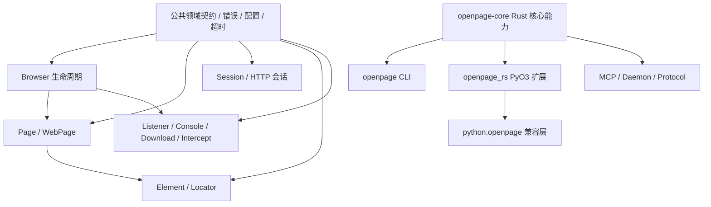

# OpenPage 大规模重构目标文档 v1

> 状态：待执行
> 日期：2026-07-20
> 目标：把 OpenPage 从“Rust 核心已较完整、Python/CLI/发布链路未完全接通、模块过大的迁移中间态”收敛为可发布、可测试、可持续演进的多语言浏览器自动化项目。

---

## 1. 重构结论

本次不是局部修补，而是一次**产品边界、模块边界、绑定边界和验证链路同时收口**的重构。

当前最严重的问题不是某个函数写错，而是：

1. Rust 核心实现和 Python 公共 API 没有形成可靠的绑定闭环。
2. CI 只验证 Rust，不验证用户真正使用的 Python 包和 CLI 发布产物。
3. 核心能力集中在少数超大文件中，边界模糊，导致迁移和维护风险持续累积。
4. 当前工作区处于大规模目录迁移中，旧接口、新接口和发布目录尚未形成单一真相。

重构后的判断标准不是“编译通过”，而是：

> Rust、Python、CLI 三个公开表面都从同一套稳定的核心契约出发，并且每次提交都能通过对应表面的真实测试。

---

## 2. 当前基线

### 2.1 项目组成

```text
openpage/
├── rust/
│   ├── crates/openpage/       Rust 浏览器自动化核心
│   ├── apps/openpage/         CLI、daemon、协议入口
│   └── bindings/python/       PyO3 Python 扩展
├── python/
│   └── openpage/              Python 兼容层与用户 API
├── tests/python/              Python 测试
├── examples/                  示例
├── docs/                      文档
├── npm/                       npm 二进制分发
└── scripts/                   构建、测试、发布脚本
```

### 2.2 已确认的硬问题

#### Python 扩展导出不完整

`rust/bindings/python/src/lib.rs` 当前只导出少量函数，而 Python 兼容层依赖 `Browser`、`Page`、`WebPage` 等对象。

当前实际结果：

```text
Ran 155 tests
FAILED (errors=66)

AttributeError: module 'openpage_rs' has no attribute 'Browser'
AttributeError: module 'openpage_rs' has no attribute 'WebPage'
```

这是发布阻断问题，不是测试质量问题。

#### CI 没有覆盖 Python 真实使用路径

当前项目检查主要是：

```bash
cargo check --manifest-path rust/Cargo.toml
cargo test --manifest-path rust/Cargo.toml
```

没有在主 CI 中完成：

- PyO3 扩展构建；
- Python 包安装；
- Python 兼容层测试；
- Python 用户 API 导入和实例化；
- CLI 发布产物验证。

#### 核心实现过度集中

当前主要文件规模：

| 文件 | 约行数 |
|---|---:|
| `rust/crates/openpage/src/page/mod.rs` | 17,874 |
| `rust/crates/openpage/src/webpage/mod.rs` | 14,386 |
| `rust/crates/openpage/src/session/mod.rs` | 11,758 |
| `rust/crates/openpage/src/element_list/mod.rs` | 10,479 |
| `rust/crates/openpage/src/browser/mod.rs` | 7,102 |
| `rust/crates/openpage/src/element/mod.rs` | 6,299 |
| `rust/apps/openpage/src/commands/oneshot.rs` | 5,386 |
| `rust/apps/openpage/src/commands/serve.rs` | 4,024 |

当前大量 `mod.rs` 只是原文件改名后的容器，并没有完成职责拆分。

---

## 3. 重构目标

### 3.1 产品目标

完成后必须满足：

1. Python 包可以从干净环境安装并使用核心 API。
2. CLI 可以独立构建、运行和发布。
3. Rust crate 可以独立测试，并保持稳定的公共 API。
4. Python、CLI、Rust 不再各自维护一套隐式行为。
5. 新功能可以明确落入一个模块，而不是继续堆进巨型文件。
6. 发布前可以用一条标准命令验证所有公开表面。

### 3.2 架构目标

目标依赖关系：



原则：

- Rust 核心是唯一行为真相。
- PyO3 只负责类型转换、生命周期和公开绑定，不复制业务逻辑。
- Python 兼容层只负责 Python 风格 API、兼容命名和参数适配。
- CLI 只负责命令解析、输出格式和进程生命周期。
- MCP/daemon/protocol 只负责传输和会话控制，不直接侵入页面业务实现。

---

## 4. 目标目录结构

不要求一次性严格达到每个文件名，但最终职责必须接近以下结构：

```text
rust/crates/openpage/src/
├── lib.rs
├── error/
│   ├── mod.rs
│   ├── codes.rs
│   └── messages.rs
├── config/
│   ├── mod.rs
│   ├── launch.rs
│   ├── timeout.rs
│   └── language.rs
├── browser/
│   ├── mod.rs
│   ├── launch.rs
│   ├── tabs.rs
│   ├── contexts.rs
│   ├── cookies.rs
│   └── downloads.rs
├── page/
│   ├── mod.rs
│   ├── navigation.rs
│   ├── actions.rs
│   ├── waits.rs
│   ├── frames.rs
│   ├── cookies.rs
│   ├── windows.rs
│   ├── scripts.rs
│   └── screenshots.rs
├── webpage/
│   ├── mod.rs
│   ├── chromium.rs
│   ├── session.rs
│   ├── mode.rs
│   └── delegation.rs
├── session/
│   ├── mod.rs
│   ├── request.rs
│   ├── response.rs
│   ├── cookies.rs
│   └── parsing.rs
├── element/
│   ├── mod.rs
│   ├── locator.rs
│   ├── actions.rs
│   ├── states.rs
│   ├── waits.rs
│   ├── frames.rs
│   └── shadow.rs
├── events/
│   ├── mod.rs
│   ├── listener.rs
│   ├── console.rs
│   ├── download.rs
│   └── intercept.rs
├── protocol/
│   ├── mod.rs
│   ├── request.rs
│   ├── response.rs
│   └── transport.rs
└── runtime/
    ├── mod.rs
    ├── locks.rs
    ├── timeouts.rs
    └── reconnect.rs
```

### 文件大小上限

这不是绝对规则，但作为重构护栏：

- `mod.rs`：目标小于 500 行；只放类型组合、公开导出和模块级说明。
- 普通实现文件：目标小于 1,200 行。
- 单个函数：目标小于 120 行；超过时必须能解释职责边界。
- 单个公开类型：优先按领域能力拆分 `impl`，避免一个类型承载所有功能。

如果一个模块确实无法拆分，不要为了满足行数硬拆；但必须有明确的职责说明和测试边界。

---

## 5. 四条核心重构线

## 5.1 绑定线：恢复并重建 Python 公共 API

### 目标

让以下代码在干净环境中成立：

```python
from openpage import Browser, ChromiumPage, WebPage

page = ChromiumPage()
page.get("https://example.com")
print(page.title)
page.quit()
```

### 方案

1. 盘点 Python 兼容层实际依赖的所有 `_openpage_rs.*` 符号。
2. 将 PyO3 类型按领域拆分到独立 Rust 文件：
   - `binding_browser.rs`
   - `binding_page.rs`
   - `binding_webpage.rs`
   - `binding_element.rs`
   - `binding_session.rs`
   - `binding_events.rs`
   - `binding_options.rs`
3. 每个绑定类型只做：
   - 参数转换；
   - 返回值转换；
   - Python 异常映射；
   - Rust 对象持有和释放。
4. 所有真实行为调用 `openpage` 核心 crate。
5. 删除或封存未接入的 `legacy_full_binding.rs`，不能保留“看起来有实现但实际没注册”的假完成状态。
6. 为每个 Python 公共类型增加最小导入/构造 smoke test。

### 验收

```bash
python -c 'import openpage; from openpage import Browser, ChromiumPage, WebPage'
python -m unittest discover -s tests/python -p 'test_*.py'
```

验收标准：

- Python 测试全部通过；
- 不允许通过测试跳过来掩盖未绑定 API；
- 不允许 Python 兼容层直接重新实现浏览器行为。

---

## 5.2 核心线：拆分领域模块，建立稳定状态边界

### Browser

`Browser` 只负责：

- 启动、连接、关闭浏览器；
- tab/context 生命周期；
- 浏览器级配置；
- 浏览器级下载、cookie、监听器；
- 共享运行时和连接管理。

不得继续把页面操作、元素操作和 CLI 行为塞进 `browser`。

### Page

`Page` 只负责一个页面上下文：

- 导航；
- 页面动作；
- 等待；
- frame；
- window；
- script；
- screenshot；
- 页面级 cookie。

每组能力使用独立 `impl` 文件，不能靠一个 17,000 行模块承载全部内容。

### WebPage

`WebPage` 是组合/门面对象，不应复制 `Page` 和 `Session` 的业务逻辑。

它只负责：

- mode 选择；
- 当前后端状态；
- Page/Session 之间的委派；
- 对外保持兼容的统一接口。

### Element / Locator

拆开以下概念：

- locator 解析；
- DOM 元素引用；
- 元素状态读取；
- 元素动作；
- 元素等待；
- frame/shadow root 进入。

禁止让 locator 解析逻辑依赖具体浏览器生命周期。

---

## 5.3 CLI / Daemon / MCP 线：隔离进程和协议边界

目标分层：

```text
CLI 参数解析
    ↓
命令服务层
    ↓
OpenPage 核心 API
    ↓
浏览器运行时
```

MCP/daemon/protocol 只能位于命令服务层与传输层，不应复制核心 API。

### CLI 必须做到

- 参数解析和业务逻辑分离；
- 机器输出和人类输出分离；
- 错误码稳定；
- stdout 只输出协议内容，日志走 stderr；
- `--help`、`--version`、错误参数、无浏览器环境都可测试；
- daemon 生命周期有明确的启动、就绪、关闭状态。

### 协议必须做到

- 请求和响应类型集中定义；
- 协议版本显式化；
- 错误结构统一；
- 不允许各命令自己拼 JSON；
- MCP/daemon 测试不依赖真实浏览器即可覆盖协议层。

---

## 5.4 验证线：从“编译通过”升级为“发布表面通过”

### 标准检查命令

新增根目录统一入口：

```bash
./scripts/test/check_all.sh
```

至少执行：

```bash
cargo fmt --all -- --check
cargo check --manifest-path rust/Cargo.toml
cargo test --manifest-path rust/Cargo.toml -- --test-threads=1

uv tool run maturin develop \
  --manifest-path rust/bindings/python/Cargo.toml \
  --features python-module \
  --uv

python -m unittest discover -s tests/python -p 'test_*.py'

cargo run --manifest-path rust/Cargo.toml --bin openpage -- --version
```

如果后续引入 lint，再增加：

```bash
cargo clippy --workspace --all-targets --all-features -- -D warnings
```

### 测试分层

```text
单元测试
├── Rust 领域逻辑
├── Python 参数/返回值适配
└── CLI 参数/协议序列化

组件测试
├── Browser ↔ Page
├── Page ↔ Element
├── WebPage ↔ Page/Session
└── CLI ↔ Core

集成测试
├── Python 公开 API
├── CLI 命令
└── 发布包安装

E2E 测试
└── 真实 Chromium 场景
```

真实浏览器测试可以慢，但不能被 CI 完全排除。应至少拆成：

- 快速 PR 检查；
- nightly/full 集成检查；
- 发布前完整检查。

---

## 6. 执行顺序

### 阶段 0：冻结当前行为

交付：

- 列出所有 Python、Rust、CLI 公共入口；
- 列出所有 `_openpage_rs` 符号；
- 为当前 API 建立兼容性清单；
- 固定一个可回滚 tag 或分支。

完成条件：

- 能明确哪些 API 必须兼容；
- 能明确哪些 API 可以删除或延期；
- 后续重构不再依赖记忆判断。

### 阶段 1：先修复 Python 绑定闭环

交付：

- 恢复 `Browser`、`Page`、`WebPage`、`Element`、options 等核心绑定；
- Python 包可以构建、安装、导入；
- Python 测试进入 CI。

完成条件：

```bash
./scripts/test/check_all.sh
```

可以在干净环境执行并通过。

### 阶段 2：拆分 Rust 核心模块

顺序建议：

1. `error`、`config`、`runtime`；
2. `browser`；
3. `page`；
4. `element`、`locator`；
5. `session`；
6. `webpage`；
7. `events`；
8. `protocol`。

每拆一个领域：

- 先移动已有实现；
- 保持公共 API 不变；
- 保持测试数量不下降；
- 立即运行 Rust 和对应 Python 测试；
- 不在同一个提交里顺便改行为。

### 阶段 3：重建 CLI / daemon / MCP 边界

交付：

- CLI 命令层不再直接承载页面业务；
- 协议请求、响应和错误类型统一；
- daemon 状态机明确；
- MCP 可以脱离真实浏览器测试协议行为。

### 阶段 4：发布链路收口

交付：

- Rust crate 发布验证；
- PyPI 安装验证；
- npm 安装验证；
- 版本号只有一个来源；
- 所有发行物都运行最小 smoke test。

### 阶段 5：删除迁移残留

可以删除：

- 未被引用的 legacy binding；
- 重复的兼容实现；
- 旧目录入口；
- 仅用于迁移的脚本和临时文档；
- 已被新协议替代的结构。

删除前必须用全局搜索确认没有引用。

---

## 7. 公共 API 规则

### Rust

- `pub` 只用于真正需要暴露的类型和方法；
- 内部实现默认私有；
- 错误类型必须可判断，不能依赖字符串匹配；
- timeout、语言、下载、连接等共享配置只能有一个来源；
- 不在页面、绑定、CLI 中各自复制一份默认值。

### Python

- Python 公开类只出现在 `python/openpage` 和 PyO3 注册层；
- 兼容别名集中管理；
- Python 异常映射稳定；
- 参数兼容逻辑不进入 Rust 核心；
- 不对外暴露未完成的半绑定对象。

### CLI

- 命令名、参数名、退出码和 JSON 字段视为公共 API；
- 机器输出必须可脚本解析；
- 任何行为变更必须有 CLI 测试。

---

## 8. 明确不做的事情

本次重构不追求：

- 一次性重写全部浏览器实现；
- 为每个内部类型设计复杂 trait 层；
- 引入新的异步运行时；
- 为了“未来可能支持”加入配置系统；
- 保留所有历史内部模块名；
- 通过兼容层继续掩盖错误绑定；
- 只增加文档而不让 CI 验证文档中的命令。

可以接受 API breaking change，但必须：

1. 明确记录；
2. 更新示例和文档；
3. 增加迁移说明；
4. 在版本号上体现破坏性变更。

---

## 9. 总体验收标准

### 必须通过

- [ ] Rust workspace `cargo check` 通过。
- [ ] Rust workspace `cargo test` 通过。
- [ ] Rust 格式检查通过。
- [ ] Python 扩展在干净环境可构建。
- [ ] `from openpage import Browser, Page, WebPage` 通过。
- [ ] Python 测试全部通过。
- [ ] CLI `--help`、`--version`、错误参数通过。
- [ ] CLI machine-readable 输出有稳定测试。
- [ ] 发布包安装后能完成最小 smoke test。
- [ ] 没有未引用的 legacy binding。
- [ ] 没有重复的核心行为实现。
- [ ] 每个核心模块都有清晰的职责边界。

### 质量目标

- `mod.rs` 只负责模块组合和导出。
- 新功能不再添加到超大 `mod.rs`。
- Python/CLI/Rust 的错误、超时和配置语义统一。
- CI 能在发布前发现 Python 绑定断裂。
- 删除迁移残留后，项目结构能被新贡献者从目录直接理解。

---

## 10. 第一批实际任务

建议直接从下面这组任务开始，不要先做全局重命名：

1. 在 `rust/bindings/python/src/lib.rs` 恢复核心 PyO3 类型注册。
2. 生成 Python 绑定符号清单，并逐项对应 `_compat.py` 调用点。
3. 修复 `tests/python` 当前 66 个错误。
4. 把 Python 构建和测试加入 `scripts/test/run_checks.sh`。
5. 新建 `scripts/test/check_all.sh`，统一 Rust、Python、CLI 检查。
6. 将 `legacy_full_binding.rs` 拆为按领域的绑定文件。
7. 拆 `browser/mod.rs`，先分离 launch、tabs、cookies、downloads、listeners。
8. 拆 `page/mod.rs`，先分离 navigation、actions、waits、frames、windows。
9. 将共享错误、配置、超时、runtime lock 收口到独立模块。
10. 删除已经不再使用的旧绑定和迁移残留。

第一阶段完成后，项目应达到：

```text
Rust 通过
Python 通过
CLI 通过
发布 smoke test 通过
```

再继续大规模模块拆分。

---

## 11. 执行进度

### 2026-07-20：阶段 1A —— 恢复 PyO3 注册与构建链路

状态：**部分完成**

已完成：

- `openpage_rs` 主模块重新注册完整绑定类型；
- 修复 PyO3 绑定在 Rust 当前错误模型下的错误映射；
- 补齐 `WebElement::Mix` 分支；
- 修正 `Page` / `WebPage` 点击新标签返回类型；
- 增加独立 PyO3 构建配置 `rust/bindings/python/pyproject.toml`；
- `cargo check --manifest-path rust/bindings/python/Cargo.toml --features python-module` 通过；
- 使用工作区 `uv` 环境完成 `maturin develop` 和 Python 包安装；
- Python 兼容层单元测试单独运行通过：89 tests。

未完成：

- `tests/python/test_openpage.py` 尚未完整通过；当前 macOS 窗口控制测试存在失败/中断；
- 两个 Python 测试文件顺序执行时会被兼容层 fake `openpage_rs` 模块污染，测试隔离需要收口；
- Python 测试尚未接入标准检查脚本和 CI；
- 绑定文件仍是单一大文件，尚未按领域拆分。

下一里程碑：**阶段 1B —— Python 测试隔离、标准检查脚本和 CI 接入**。

### 2026-07-20：阶段 1B —— 统一检查入口

状态：**进行中**

已完成：

- 新增 `scripts/test/check_all.sh`；
- Rust 格式、检查、测试统一纳入检查入口；
- 使用 `scripts/dev/dev_install.sh` 构建并安装 PyO3 扩展；
- 两个 Python 测试文件按进程隔离执行，避免 fake `openpage_rs` 污染集成测试。

待完成：

- `test_openpage.py` 的 macOS 窗口控制测试需要在真实桌面权限/窗口环境下完成；
- Linux CI 需要验证完整脚本；
- 需要把 Python 测试结果作为 CI 必须门禁。

### 2026-07-20：阶段 1C —— Python 绑定按领域拆分

状态：**完成**

已完成：

- 将原约 3,488 行的 `legacy_full_binding.rs` 拆为按领域组织的模块目录；
- 分离 Browser、Page、Element、Session、WebPage、Events 六组绑定实现；
- 保留共享 PyO3 类型、转换函数和注册入口在 `legacy_full_binding/mod.rs`；
- 保持既有 Python 导出类名和注册行为不变；
- 修复模块声明位置与 Rust 文件路径问题，避免把 `mod` 放入 PyO3 属性宏输入；
- `cargo fmt --manifest-path rust/Cargo.toml --all` 通过；
- `cargo check --manifest-path rust/bindings/python/Cargo.toml --features python-module` 通过；
- `scripts/dev/dev_install.sh` 构建并安装扩展成功；
- `tests/python/test_compat_download_wait.py`：89 tests 通过。

说明：完整 `test_openpage.py` 仍包含 macOS 窗口控制环境依赖，尚未将其结果误判为绑定拆分已全部验收。下一阶段继续处理真实集成测试隔离、CI 门禁及 Rust 核心巨型模块拆分。

### 2026-07-20：阶段 2A —— Browser 核心操作拆分

状态：**完成**

已完成：

- 从 `browser/mod.rs` 分离 `impl Browser` 的核心操作实现到 `browser/operations.rs`；
- `browser/mod.rs` 从 7,102 行降至约 5,474 行；
- 保持 Browser 类型、配置类型、解析逻辑和模块公开 API 不变；
- 仅将跨子模块测试需要调用的 `isolated_context_id` 提升为 `pub(crate)`，未增加兼容层或 Adapter；
- `cargo fmt --manifest-path rust/Cargo.toml --all` 通过；
- `cargo check --manifest-path rust/Cargo.toml` 通过；
- `cargo test --manifest-path rust/Cargo.toml --package openpage --lib -- --test-threads=1` 通过：632 tests。

下一步：继续将 Browser 的 launch/config、downloads、tabs、cookies 等职责从 `mod.rs` 中拆出，直到模块组合文件只保留类型、共享状态和导出。

### 2026-07-20：阶段 2B —— Browser 启动与基础设施拆分

状态：**完成**

已完成：

- 将 Browser 启动、配置文件解析、调试地址、下载目录、Chrome 配置、下载路径和通用 CDP 超时辅助逻辑移至 `browser/launch.rs`；
- `browser/mod.rs` 从约 5,474 行降至约 1,231 行；
- 保留 `Browser`、`LaunchOptions`、状态结构和 tab 输入类型在组合模块；
- `operations.rs` 与 `launch.rs` 通过明确的模块可见性共享核心逻辑，没有新增 Helper、Adapter 或回退兼容层；
- `cargo fmt --manifest-path rust/Cargo.toml --all` 通过；
- `cargo check --manifest-path rust/Cargo.toml` 通过；
- `cargo test --manifest-path rust/Cargo.toml --package openpage --lib -- --test-threads=1` 通过：632 tests。

下一步：继续拆分 Browser 的 tab、cookie、download、listener 操作，使 `operations.rs` 也按职责收口。
