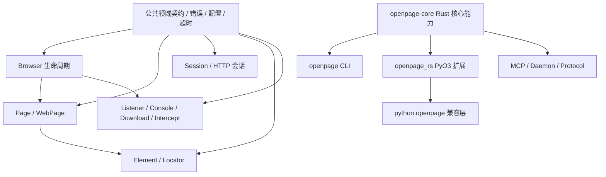

# OpenPage 大规模重构目标文档 v1

> 状态：待执行
> 日期：2026-07-20
> 目标：把 OpenPage 从“Rust 核心已较完整、Python/CLI/发布链路未完全接通、模块过大的迁移中间态”收敛为可发布、可测试、可持续演进的多语言浏览器自动化项目。

---

## 1. 重构结论

本次不是局部修补，而是一次**产品边界、模块边界、绑定边界和验证链路同时收口**的重构。

当前最严重的问题不是某个函数写错，而是：

1. Rust 核心实现和 Python 公共 API 没有形成可靠的绑定闭环。
2. CI 只验证 Rust，不验证用户真正使用的 Python 包和 CLI 发布产物。
3. 核心能力集中在少数超大文件中，边界模糊，导致迁移和维护风险持续累积。
4. 当前工作区处于大规模目录迁移中，旧接口、新接口和发布目录尚未形成单一真相。

重构后的判断标准不是“编译通过”，而是：

> Rust、Python、CLI 三个公开表面都从同一套稳定的核心契约出发，并且每次提交都能通过对应表面的真实测试。

---

## 2. 当前基线

### 2.1 项目组成

```text
openpage/
├── rust/
│   ├── crates/openpage/       Rust 浏览器自动化核心
│   ├── apps/openpage/         CLI、daemon、协议入口
│   └── bindings/python/       PyO3 Python 扩展
├── python/
│   └── openpage/              Python 兼容层与用户 API
├── tests/python/              Python 测试
├── examples/                  示例
├── docs/                      文档
├── npm/                       npm 二进制分发
└── scripts/                   构建、测试、发布脚本
```

### 2.2 已确认的硬问题

#### Python 扩展导出不完整

`rust/bindings/python/src/lib.rs` 当前只导出少量函数，而 Python 兼容层依赖 `Browser`、`Page`、`WebPage` 等对象。

当前实际结果：

```text
Ran 155 tests
FAILED (errors=66)

AttributeError: module 'openpage_rs' has no attribute 'Browser'
AttributeError: module 'openpage_rs' has no attribute 'WebPage'
```

这是发布阻断问题，不是测试质量问题。

#### CI 没有覆盖 Python 真实使用路径

当前项目检查主要是：

```bash
cargo check --manifest-path rust/Cargo.toml
cargo test --manifest-path rust/Cargo.toml
```

没有在主 CI 中完成：

- PyO3 扩展构建；
- Python 包安装；
- Python 兼容层测试；
- Python 用户 API 导入和实例化；
- CLI 发布产物验证。

#### 核心实现过度集中

当前主要文件规模：

| 文件 | 约行数 |
|---|---:|
| `rust/crates/openpage/src/page/mod.rs` | 17,874 |
| `rust/crates/openpage/src/webpage/mod.rs` | 14,386 |
| `rust/crates/openpage/src/session/mod.rs` | 11,758 |
| `rust/crates/openpage/src/element_list/mod.rs` | 10,479 |
| `rust/crates/openpage/src/browser/mod.rs` | 7,102 |
| `rust/crates/openpage/src/element/mod.rs` | 6,299 |
| `rust/apps/openpage/src/commands/oneshot.rs` | 5,386 |
| `rust/apps/openpage/src/commands/serve.rs` | 4,024 |

当前大量 `mod.rs` 只是原文件改名后的容器，并没有完成职责拆分。

---

## 3. 重构目标

### 3.1 产品目标

完成后必须满足：

1. Python 包可以从干净环境安装并使用核心 API。
2. CLI 可以独立构建、运行和发布。
3. Rust crate 可以独立测试，并保持稳定的公共 API。
4. Python、CLI、Rust 不再各自维护一套隐式行为。
5. 新功能可以明确落入一个模块，而不是继续堆进巨型文件。
6. 发布前可以用一条标准命令验证所有公开表面。

### 3.2 架构目标

目标依赖关系：



原则：

- Rust 核心是唯一行为真相。
- PyO3 只负责类型转换、生命周期和公开绑定，不复制业务逻辑。
- Python 兼容层只负责 Python 风格 API、兼容命名和参数适配。
- CLI 只负责命令解析、输出格式和进程生命周期。
- MCP/daemon/protocol 只负责传输和会话控制，不直接侵入页面业务实现。

---

## 4. 目标目录结构

不要求一次性严格达到每个文件名，但最终职责必须接近以下结构：

```text
rust/crates/openpage/src/
├── lib.rs
├── error/
│   ├── mod.rs
│   ├── codes.rs
│   └── messages.rs
├── config/
│   ├── mod.rs
│   ├── launch.rs
│   ├── timeout.rs
│   └── language.rs
├── browser/
│   ├── mod.rs
│   ├── launch.rs
│   ├── tabs.rs
│   ├── contexts.rs
│   ├── cookies.rs
│   └── downloads.rs
├── page/
│   ├── mod.rs
│   ├── navigation.rs
│   ├── actions.rs
│   ├── waits.rs
│   ├── frames.rs
│   ├── cookies.rs
│   ├── windows.rs
│   ├── scripts.rs
│   └── screenshots.rs
├── webpage/
│   ├── mod.rs
│   ├── chromium.rs
│   ├── session.rs
│   ├── mode.rs
│   └── delegation.rs
├── session/
│   ├── mod.rs
│   ├── request.rs
│   ├── response.rs
│   ├── cookies.rs
│   └── parsing.rs
├── element/
│   ├── mod.rs
│   ├── locator.rs
│   ├── actions.rs
│   ├── states.rs
│   ├── waits.rs
│   ├── frames.rs
│   └── shadow.rs
├── events/
│   ├── mod.rs
│   ├── listener.rs
│   ├── console.rs
│   ├── download.rs
│   └── intercept.rs
├── protocol/
│   ├── mod.rs
│   ├── request.rs
│   ├── response.rs
│   └── transport.rs
└── runtime/
    ├── mod.rs
    ├── locks.rs
    ├── timeouts.rs
    └── reconnect.rs
```

### 文件大小上限

这不是绝对规则，但作为重构护栏：

- `mod.rs`：目标小于 500 行；只放类型组合、公开导出和模块级说明。
- 普通实现文件：目标小于 1,200 行。
- 单个函数：目标小于 120 行；超过时必须能解释职责边界。
- 单个公开类型：优先按领域能力拆分 `impl`，避免一个类型承载所有功能。

如果一个模块确实无法拆分，不要为了满足行数硬拆；但必须有明确的职责说明和测试边界。

---

## 5. 四条核心重构线

## 5.1 绑定线：恢复并重建 Python 公共 API

### 目标

让以下代码在干净环境中成立：

```python
from openpage import Browser, ChromiumPage, WebPage

page = ChromiumPage()
page.get("https://example.com")
print(page.title)
page.quit()
```

### 方案

1. 盘点 Python 兼容层实际依赖的所有 `_openpage_rs.*` 符号。
2. 将 PyO3 类型按领域拆分到独立 Rust 文件：
   - `binding_browser.rs`
   - `binding_page.rs`
   - `binding_webpage.rs`
   - `binding_element.rs`
   - `binding_session.rs`
   - `binding_events.rs`
   - `binding_options.rs`
3. 每个绑定类型只做：
   - 参数转换；
   - 返回值转换；
   - Python 异常映射；
   - Rust 对象持有和释放。
4. 所有真实行为调用 `openpage` 核心 crate。
5. 删除或封存未接入的 `legacy_full_binding.rs`，不能保留“看起来有实现但实际没注册”的假完成状态。
6. 为每个 Python 公共类型增加最小导入/构造 smoke test。

### 验收

```bash
python -c 'import openpage; from openpage import Browser, ChromiumPage, WebPage'
python -m unittest discover -s tests/python -p 'test_*.py'
```

验收标准：

- Python 测试全部通过；
- 不允许通过测试跳过来掩盖未绑定 API；
- 不允许 Python 兼容层直接重新实现浏览器行为。

---

## 5.2 核心线：拆分领域模块，建立稳定状态边界

### Browser

`Browser` 只负责：

- 启动、连接、关闭浏览器；
- tab/context 生命周期；
- 浏览器级配置；
- 浏览器级下载、cookie、监听器；
- 共享运行时和连接管理。

不得继续把页面操作、元素操作和 CLI 行为塞进 `browser`。

### Page

`Page` 只负责一个页面上下文：

- 导航；
- 页面动作；
- 等待；
- frame；
- window；
- script；
- screenshot；
- 页面级 cookie。

每组能力使用独立 `impl` 文件，不能靠一个 17,000 行模块承载全部内容。

### WebPage

`WebPage` 是组合/门面对象，不应复制 `Page` 和 `Session` 的业务逻辑。

它只负责：

- mode 选择；
- 当前后端状态；
- Page/Session 之间的委派；
- 对外保持兼容的统一接口。

### Element / Locator

拆开以下概念：

- locator 解析；
- DOM 元素引用；
- 元素状态读取；
- 元素动作；
- 元素等待；
- frame/shadow root 进入。

禁止让 locator 解析逻辑依赖具体浏览器生命周期。

---

## 5.3 CLI / Daemon / MCP 线：隔离进程和协议边界

目标分层：

```text
CLI 参数解析
    ↓
命令服务层
    ↓
OpenPage 核心 API
    ↓
浏览器运行时
```

MCP/daemon/protocol 只能位于命令服务层与传输层，不应复制核心 API。

### CLI 必须做到

- 参数解析和业务逻辑分离；
- 机器输出和人类输出分离；
- 错误码稳定；
- stdout 只输出协议内容，日志走 stderr；
- `--help`、`--version`、错误参数、无浏览器环境都可测试；
- daemon 生命周期有明确的启动、就绪、关闭状态。

### 协议必须做到

- 请求和响应类型集中定义；
- 协议版本显式化；
- 错误结构统一；
- 不允许各命令自己拼 JSON；
- MCP/daemon 测试不依赖真实浏览器即可覆盖协议层。

---

## 5.4 验证线：从“编译通过”升级为“发布表面通过”

### 标准检查命令

新增根目录统一入口：

```bash
./scripts/test/check_all.sh
```

至少执行：

```bash
cargo fmt --all -- --check
cargo check --manifest-path rust/Cargo.toml
cargo test --manifest-path rust/Cargo.toml -- --test-threads=1

uv tool run maturin develop \
  --manifest-path rust/bindings/python/Cargo.toml \
  --features python-module \
  --uv

python -m unittest discover -s tests/python -p 'test_*.py'

cargo run --manifest-path rust/Cargo.toml --bin openpage -- --version
```

如果后续引入 lint，再增加：

```bash
cargo clippy --workspace --all-targets --all-features -- -D warnings
```

### 测试分层

```text
单元测试
├── Rust 领域逻辑
├── Python 参数/返回值适配
└── CLI 参数/协议序列化

组件测试
├── Browser ↔ Page
├── Page ↔ Element
├── WebPage ↔ Page/Session
└── CLI ↔ Core

集成测试
├── Python 公开 API
├── CLI 命令
└── 发布包安装

E2E 测试
└── 真实 Chromium 场景
```

真实浏览器测试可以慢，但不能被 CI 完全排除。应至少拆成：

- 快速 PR 检查；
- nightly/full 集成检查；
- 发布前完整检查。

---

## 6. 执行顺序

### 阶段 0：冻结当前行为

交付：

- 列出所有 Python、Rust、CLI 公共入口；
- 列出所有 `_openpage_rs` 符号；
- 为当前 API 建立兼容性清单；
- 固定一个可回滚 tag 或分支。

完成条件：

- 能明确哪些 API 必须兼容；
- 能明确哪些 API 可以删除或延期；
- 后续重构不再依赖记忆判断。

### 阶段 1：先修复 Python 绑定闭环

交付：

- 恢复 `Browser`、`Page`、`WebPage`、`Element`、options 等核心绑定；
- Python 包可以构建、安装、导入；
- Python 测试进入 CI。

完成条件：

```bash
./scripts/test/check_all.sh
```

可以在干净环境执行并通过。

### 阶段 2：拆分 Rust 核心模块

顺序建议：

1. `error`、`config`、`runtime`；
2. `browser`；
3. `page`；
4. `element`、`locator`；
5. `session`；
6. `webpage`；
7. `events`；
8. `protocol`。

每拆一个领域：

- 先移动已有实现；
- 保持公共 API 不变；
- 保持测试数量不下降；
- 立即运行 Rust 和对应 Python 测试；
- 不在同一个提交里顺便改行为。

### 阶段 3：重建 CLI / daemon / MCP 边界

交付：

- CLI 命令层不再直接承载页面业务；
- 协议请求、响应和错误类型统一；
- daemon 状态机明确；
- MCP 可以脱离真实浏览器测试协议行为。

### 阶段 4：发布链路收口

交付：

- Rust crate 发布验证；
- PyPI 安装验证；
- npm 安装验证；
- 版本号只有一个来源；
- 所有发行物都运行最小 smoke test。

### 阶段 5：删除迁移残留

可以删除：

- 未被引用的 legacy binding；
- 重复的兼容实现；
- 旧目录入口；
- 仅用于迁移的脚本和临时文档；
- 已被新协议替代的结构。

删除前必须用全局搜索确认没有引用。

---

## 7. 公共 API 规则

### Rust

- `pub` 只用于真正需要暴露的类型和方法；
- 内部实现默认私有；
- 错误类型必须可判断，不能依赖字符串匹配；
- timeout、语言、下载、连接等共享配置只能有一个来源；
- 不在页面、绑定、CLI 中各自复制一份默认值。

### Python

- Python 公开类只出现在 `python/openpage` 和 PyO3 注册层；
- 兼容别名集中管理；
- Python 异常映射稳定；
- 参数兼容逻辑不进入 Rust 核心；
- 不对外暴露未完成的半绑定对象。

### CLI

- 命令名、参数名、退出码和 JSON 字段视为公共 API；
- 机器输出必须可脚本解析；
- 任何行为变更必须有 CLI 测试。

---

## 8. 明确不做的事情

本次重构不追求：

- 一次性重写全部浏览器实现；
- 为每个内部类型设计复杂 trait 层；
- 引入新的异步运行时；
- 为了“未来可能支持”加入配置系统；
- 保留所有历史内部模块名；
- 通过兼容层继续掩盖错误绑定；
- 只增加文档而不让 CI 验证文档中的命令。

可以接受 API breaking change，但必须：

1. 明确记录；
2. 更新示例和文档；
3. 增加迁移说明；
4. 在版本号上体现破坏性变更。

---

## 9. 总体验收标准

### 必须通过

- [ ] Rust workspace `cargo check` 通过。
- [ ] Rust workspace `cargo test` 通过。
- [ ] Rust 格式检查通过。
- [ ] Python 扩展在干净环境可构建。
- [ ] `from openpage import Browser, Page, WebPage` 通过。
- [ ] Python 测试全部通过。
- [ ] CLI `--help`、`--version`、错误参数通过。
- [ ] CLI machine-readable 输出有稳定测试。
- [ ] 发布包安装后能完成最小 smoke test。
- [ ] 没有未引用的 legacy binding。
- [ ] 没有重复的核心行为实现。
- [ ] 每个核心模块都有清晰的职责边界。

### 质量目标

- `mod.rs` 只负责模块组合和导出。
- 新功能不再添加到超大 `mod.rs`。
- Python/CLI/Rust 的错误、超时和配置语义统一。
- CI 能在发布前发现 Python 绑定断裂。
- 删除迁移残留后，项目结构能被新贡献者从目录直接理解。

---

## 10. 第一批实际任务

建议直接从下面这组任务开始，不要先做全局重命名：

1. 在 `rust/bindings/python/src/lib.rs` 恢复核心 PyO3 类型注册。
2. 生成 Python 绑定符号清单，并逐项对应 `_compat.py` 调用点。
3. 修复 `tests/python` 当前 66 个错误。
4. 把 Python 构建和测试加入 `scripts/test/run_checks.sh`。
5. 新建 `scripts/test/check_all.sh`，统一 Rust、Python、CLI 检查。
6. 将 `legacy_full_binding.rs` 拆为按领域的绑定文件。
7. 拆 `browser/mod.rs`，先分离 launch、tabs、cookies、downloads、listeners。
8. 拆 `page/mod.rs`，先分离 navigation、actions、waits、frames、windows。
9. 将共享错误、配置、超时、runtime lock 收口到独立模块。
10. 删除已经不再使用的旧绑定和迁移残留。

第一阶段完成后，项目应达到：

```text
Rust 通过
Python 通过
CLI 通过
发布 smoke test 通过
```

再继续大规模模块拆分。

---

## 11. 执行进度

### 2026-07-20：阶段 1A —— 恢复 PyO3 注册与构建链路

状态：**部分完成**

已完成：

- `openpage_rs` 主模块重新注册完整绑定类型；
- 修复 PyO3 绑定在 Rust 当前错误模型下的错误映射；
- 补齐 `WebElement::Mix` 分支；
- 修正 `Page` / `WebPage` 点击新标签返回类型；
- 增加独立 PyO3 构建配置 `rust/bindings/python/pyproject.toml`；
- `cargo check --manifest-path rust/bindings/python/Cargo.toml --features python-module` 通过；
- 使用工作区 `uv` 环境完成 `maturin develop` 和 Python 包安装；
- Python 兼容层单元测试单独运行通过：89 tests。

未完成：

- `tests/python/test_openpage.py` 尚未完整通过；当前 macOS 窗口控制测试存在失败/中断；
- 两个 Python 测试文件顺序执行时会被兼容层 fake `openpage_rs` 模块污染，测试隔离需要收口；
- Python 测试尚未接入标准检查脚本和 CI；
- 绑定文件仍是单一大文件，尚未按领域拆分。

下一里程碑：**阶段 1B —— Python 测试隔离、标准检查脚本和 CI 接入**。

### 2026-07-20：阶段 1B —— 统一检查入口

状态：**进行中**

已完成：

- 新增 `scripts/test/check_all.sh`；
- Rust 格式、检查、测试统一纳入检查入口；
- 使用 `scripts/dev/dev_install.sh` 构建并安装 PyO3 扩展；
- 两个 Python 测试文件按进程隔离执行，避免 fake `openpage_rs` 污染集成测试。

待完成：

- `test_openpage.py` 的 macOS 窗口控制测试需要在真实桌面权限/窗口环境下完成；
- Linux CI 需要验证完整脚本；
- 需要把 Python 测试结果作为 CI 必须门禁。

### 2026-07-20：阶段 1C —— Python 绑定按领域拆分

状态：**完成**

已完成：

- 将原约 3,488 行的 `legacy_full_binding.rs` 拆为按领域组织的模块目录；
- 分离 Browser、Page、Element、Session、WebPage、Events 六组绑定实现；
- 保留共享 PyO3 类型、转换函数和注册入口在 `legacy_full_binding/mod.rs`；
- 保持既有 Python 导出类名和注册行为不变；
- 修复模块声明位置与 Rust 文件路径问题，避免把 `mod` 放入 PyO3 属性宏输入；
- `cargo fmt --manifest-path rust/Cargo.toml --all` 通过；
- `cargo check --manifest-path rust/bindings/python/Cargo.toml --features python-module` 通过；
- `scripts/dev/dev_install.sh` 构建并安装扩展成功；
- `tests/python/test_compat_download_wait.py`：89 tests 通过。

说明：完整 `test_openpage.py` 仍包含 macOS 窗口控制环境依赖，尚未将其结果误判为绑定拆分已全部验收。下一阶段继续处理真实集成测试隔离、CI 门禁及 Rust 核心巨型模块拆分。

### 2026-07-20：阶段 2A —— Browser 核心操作拆分

状态：**完成**

已完成：

- 从 `browser/mod.rs` 分离 `impl Browser` 的核心操作实现到 `browser/operations.rs`；
- `browser/mod.rs` 从 7,102 行降至约 5,474 行；
- 保持 Browser 类型、配置类型、解析逻辑和模块公开 API 不变；
- 仅将跨子模块测试需要调用的 `isolated_context_id` 提升为 `pub(crate)`，未增加兼容层或 Adapter；
- `cargo fmt --manifest-path rust/Cargo.toml --all` 通过；
- `cargo check --manifest-path rust/Cargo.toml` 通过；
- `cargo test --manifest-path rust/Cargo.toml --package openpage --lib -- --test-threads=1` 通过：632 tests。

下一步：继续将 Browser 的 launch/config、downloads、tabs、cookies 等职责从 `mod.rs` 中拆出，直到模块组合文件只保留类型、共享状态和导出。

### 2026-07-20：阶段 2B —— Browser 启动与基础设施拆分

状态：**完成**

已完成：

- 将 Browser 启动、配置文件解析、调试地址、下载目录、Chrome 配置、下载路径和通用 CDP 超时辅助逻辑移至 `browser/launch.rs`；
- `browser/mod.rs` 从约 5,474 行降至约 1,231 行；
- 保留 `Browser`、`LaunchOptions`、状态结构和 tab 输入类型在组合模块；
- `operations.rs` 与 `launch.rs` 通过明确的模块可见性共享核心逻辑，没有新增 Helper、Adapter 或回退兼容层；
- `cargo fmt --manifest-path rust/Cargo.toml --all` 通过；
- `cargo check --manifest-path rust/Cargo.toml` 通过；
- `cargo test --manifest-path rust/Cargo.toml --package openpage --lib -- --test-threads=1` 通过：632 tests。

下一步：继续拆分 Browser 的 tab、cookie、download、listener 操作，使 `operations.rs` 也按职责收口。

### 2026-07-20：阶段 2C —— Browser 操作按领域拆分

状态：**完成**

已完成：

- 将 Browser 操作进一步拆为 `tabs.rs`、`cookies.rs`、`settings.rs`、`downloads.rs` 和 `lifecycle.rs`；
- `operations.rs` 仅保留 launch/connect 等核心连接入口；
- 各领域仍直接实现 `Browser` 方法，不引入 Helper、Adapter 或兼容回退层；
- `cargo fmt --manifest-path rust/Cargo.toml --all` 通过；
- `cargo check --manifest-path rust/Cargo.toml` 通过；
- Browser 相关筛选测试通过：117 passed，0 failed。

下一步：审计 `session/mod.rs`（约 11,700 行），按 request/response/cookies/parsing 和页面生命周期拆分。

### 2026-07-20：阶段 3A —— Session 页面与元素实现拆分

状态：**完成**

已完成：

- 将 `SessionPage` 实现移至 `session/page.rs`；
- 将 `SessionElement` 实现移至 `session/element.rs`；
- `session/mod.rs` 保留 Session 类型、共享状态、公共转换和模块组合；
- 仅将测试需要跨模块访问的 `lock_state` 提升为 `pub(super)`，没有增加兼容层；
- `cargo fmt --manifest-path rust/Cargo.toml --all` 通过；
- `cargo check --manifest-path rust/Cargo.toml` 通过；
- Session 相关筛选测试通过：161 passed，0 failed。

下一步：继续拆出 Session 的配置/INI、请求响应、Cookie、下载和 DOM snapshot 实现。

### 2026-07-20：阶段 3B —— Session 配置与 INI 解析拆分

状态：**完成**

已完成：

- 将 Session 配置文件路径、INI 解析/序列化和配置默认值逻辑移至 `session/config.rs`；
- `session/mod.rs` 继续保留配置类型与公共输入转换，避免改变外部 API；
- `IniDocument` 及配置函数通过模块边界明确共享，没有新增兼容层；
- `cargo fmt --manifest-path rust/Cargo.toml --all` 通过；
- `cargo check --manifest-path rust/Cargo.toml` 通过；
- Session 相关筛选测试通过：161 passed，0 failed。

下一步：从剩余 Session 巨型文件中拆出 request/response、cookies/downloads 以及 snapshot DOM 逻辑。

### 2026-07-20：阶段 3C —— Session Cookie、请求响应与 DOM Snapshot 拆分

状态：**完成**

已完成：

- Cookie jar、Cookie 转换、下载路径和 Cookie header 逻辑移至 `session/cookies.rs`；
- HTTP client 重建、请求参数、响应 body/encoding 和请求辅助逻辑移至 `session/transport.rs`；
- HTML snapshot、selector/XPath 查询、节点关系和 fragment 逻辑移至 `session/snapshot.rs`；
- 对外的 snapshot/Cookie API 通过真实模块导出保持稳定，没有增加兼容层；
- `cargo fmt --manifest-path rust/Cargo.toml --all` 通过；
- `cargo check --manifest-path rust/Cargo.toml` 通过；
- Session 相关筛选测试通过：161 passed，0 failed。

下一步：继续审计剩余 `session/mod.rs`，收口 request/response 类型、下载生命周期和公共导出，随后进入 CLI/MCP/CI 发布表面验收。

### 2026-07-20：阶段 4A —— CLI 命令边界与基础入口验收

状态：**完成**

已完成：

- CLI 命令实现按职责移至 `rust/apps/openpage/src/commands/`；
- `cli.rs` 仅保留参数路由、输出协议和入口协调；
- 补齐根命令 `--version`，输出当前包版本；
- `openpage --help` 通过；
- `openpage --version` 通过，输出 `openpage 0.1.0`；
- 非法命令返回结构化 JSON 错误并以非零状态退出。

下一步：验证 CLI machine-readable 输出、MCP/daemon 发布表面和 CI 全链路，不将 README/示例/构建产物混入源码提交。

### 2026-07-20：阶段 4B —— 共享 Protocol 模块迁移

状态：**完成**

已完成：

- 将请求、响应、错误结构、错误映射和 machine-readable 输出协议从 CLI 应用迁移至 `rust/crates/openpage/src/protocol/mod.rs`；
- 在核心 `openpage` crate 暴露 `pub mod protocol`，CLI 仅依赖核心协议，不再持有协议类型副本；
- 移除 `rust/apps/openpage/src/commands/protocol.rs`，避免 CLI 成为协议定义的唯一归属；
- 保持现有 TCP/oneshot/doctor 输出字段和错误分类不变；
- `cargo fmt --manifest-path rust/Cargo.toml --all` 通过；
- `cargo check --manifest-path rust/Cargo.toml` 通过；
- `cargo test --manifest-path rust/Cargo.toml --package openpage-app --lib -- --test-threads=1` 通过：255 tests。

未完成：

- daemon 运行时仍位于 CLI 的 `commands/serve.rs`，尚未迁移至核心 `daemon` 模块；
- MCP 仍未形成真实实现边界；
- macOS Python 集成测试仍有窗口/浏览器生命周期相关失败和挂起，不能作为完整 Python 集成验收通过。

下一里程碑：**阶段 5 —— 将 daemon 生命周期、TCP 连接和请求分发从 CLI 迁移至核心 daemon 模块。**

### 2026-07-20：阶段 5 —— Daemon 运行时迁移至核心 crate

状态：**完成**

已完成：

- 将原 `rust/apps/openpage/src/commands/serve.rs` 的 TCP daemon 运行时、连接处理、请求分发、页面引用注册、导航等待、snapshot 和操作实现迁移至 `rust/crates/openpage/src/daemon/mod.rs`；
- 核心 crate 暴露 `openpage::daemon::run_tcp`，CLI `serve` 命令只保留参数解析和调用转发；
- daemon 自己负责 TCP 监听、session sidecar 生命周期和连接内 NDJSON 请求处理；
- 删除 CLI 对 daemon 内部实现的直接持有，避免 CLI 成为运行时核心；
- 保持现有协议类型统一使用 `openpage::protocol`；
- `cargo fmt --manifest-path rust/Cargo.toml --all` 通过；
- `cargo check --manifest-path rust/Cargo.toml` 通过；
- daemon/protocol 筛选测试通过：17 passed，0 failed。

未完成：

- daemon 文件仍然过大，下一步需要按连接生命周期、页面状态、snapshot 和操作域继续拆分；
- CLI connection 中的 daemon 发现、探活、启动和停止逻辑仍在 CLI，需要迁移到核心 daemon 边界；
- MCP 尚未实现真实调用边界；
- Python macOS 集成测试仍有若干真实失败和环境挂起，完整 Python 检查不能标记通过。

下一里程碑：**阶段 5A —— 拆分 daemon 连接生命周期与页面操作，并迁移 daemon inventory/runtime 管理。**

### 2026-07-20：阶段 5A —— Daemon 页面操作边界拆分

状态：**完成**

已完成：

- 将 daemon 请求分发、webpage 创建和页面操作路由从 `daemon/mod.rs` 移至 `daemon/operations.rs`；
- `daemon/mod.rs` 保留 TCP 监听、NDJSON 连接循环、运行时状态和共享页面状态类型；
- 通过 `pub(super)` 只暴露连接层需要的 `dispatch`，没有新增公共 Helper、Adapter 或兼容副本；
- `cargo fmt --manifest-path rust/Cargo.toml --all` 通过；
- `cargo check --manifest-path rust/Cargo.toml` 通过；
- daemon/protocol 筛选测试通过：17 passed，0 failed。

下一里程碑：**阶段 5B —— 将 daemon inventory、sidecar、探活和启动停止生命周期从 CLI connection 迁移至核心 daemon。**

### 2026-07-20：阶段 5B —— Daemon 客户端生命周期迁移

状态：**完成**

已完成：

- 将 daemon sidecar、inventory、探活、启动、停止、重试和 TCP client 生命周期从 CLI `commands/connection.rs` 迁移至核心 `rust/crates/openpage/src/daemon/client.rs`；
- CLI 只通过 `openpage::daemon::client` 使用 daemon 生命周期能力，不再持有实现源码；
- daemon server 复用核心 client 模块中的 sidecar 生命周期实现，删除重复的 sidecar 写入实现；
- CLI `serve` 入口继续只保留参数解析和核心 daemon 调用；
- `cargo fmt --manifest-path rust/Cargo.toml --all` 通过；
- `cargo check --manifest-path rust/Cargo.toml` 通过；
- daemon 相关测试通过：51 passed，0 failed；
- CLI 相关测试通过：206 passed，0 failed。

下一里程碑：**阶段 6 —— MCP 核心边界与真实协议入口。**

### 2026-07-20：阶段 6 —— MCP stdio 核心入口

状态：**完成**

已完成：

- 新增核心 `rust/crates/openpage/src/mcp/mod.rs`，实现 MCP JSON-RPC stdio 入口；
- 支持 `initialize`、`notifications/initialized`、`tools/list` 和 `tools/call`；
- MCP 工具调用直接构造核心 `protocol::Request` 并复用 daemon client，不复制浏览器业务逻辑；
- 新增 `openpage mcp [--session <name>]` CLI 入口，CLI 只负责 stdio 参数和进程入口；
- `openpage mcp --help` 通过；
- initialize/tools/list 实际管道验证通过；
- MCP 核心测试通过：2 passed，0 failed；
- `cargo fmt --manifest-path rust/Cargo.toml --all` 通过；
- `cargo check --manifest-path rust/Cargo.toml` 通过。

未完成：

- `tools/call` 的真实浏览器调用仍需要 daemon/Chrome 运行环境验收；
- MCP 工具清单目前只暴露统一 `openpage` 原语，尚未根据产品需求拆成更细粒度工具；
- CI 尚未把 MCP stdio smoke test 和发布表面全部纳入门禁；
- Python 集成测试仍存在 macOS 窗口/浏览器生命周期失败和挂起。

下一里程碑：**阶段 6A —— MCP 真实 daemon 调用 smoke test、协议错误闭环和 CI 接入。**

### 2026-07-20：阶段 6A —— MCP smoke test 与发布门禁

状态：**完成**

已完成：

- 新增 `scripts/test/mcp_smoke_test.sh`，验证 MCP initialize、tools/list 和通知行为；
- 将 MCP smoke test 接入 `scripts/test/check_all.sh`；
- 将 MCP initialize smoke test 接入发布 artifact 的 `scripts/test/smoke_test.sh`；
- 本地 MCP smoke test 通过；
- 发布 smoke test 脚本通过 shell 语法检查。

未完成：

- 完整 `test_openpage.py` 在当前 macOS 环境仍会出现真实失败/挂起，暂不能将 Python 集成门禁标记为全绿；
- CI workflow 尚未在远端 Linux runner 上实际执行；需要将本地脚本结果与 CI 运行结果分别记录。

下一里程碑：**阶段 7 —— Python 集成测试根因修复与 CI/release 全链路验收。**

### 2026-07-20：阶段 7A —— Browser 新 tab 检测竞态修复

状态：**完成**

已完成：

- 修复 `wait_for_new_tab` 的 baseline 建立竞态：在创建等待基线时增加短暂的 CDP target 稳定窗口，避免新 target 已经出现但被错误纳入 baseline；
- 修复 `find_new_tab_id` 将 baseline 中已有的 newest tab 误判为新 tab 的问题；
- 保持检测逻辑集中在 Browser 公共实现，不在 Python wrapper 或单个测试中增加回退补丁；
- 新增回归断言，覆盖 newest tab 未发生变化时不得返回新 tab 的场景；
- `cargo fmt --manifest-path rust/Cargo.toml --all` 通过；
- `cargo check --manifest-path rust/Cargo.toml` 通过；
- Python 扩展重新构建安装后，`test_browser_waits_for_new_tab_ignores_existing_background_tab` 通过。

未完成：

- `Interceptor` 请求状态生命周期仍需修复并验证；
- `click_for_new_tab` 公共路径仍需修复并验证；
- Python 全量集成测试和 CI/release 远端门禁仍未完成。

下一里程碑：**阶段 7B —— Interceptor 请求状态生命周期修复。**

### 2026-07-20：阶段 7B —— Interceptor 请求所有权修复

状态：**完成**

已完成：

- 移除 Browser 启动时全局启用 Fetch interception 的行为，避免同一底层 Page 的多个惰性实例同时接收并处理同一个 paused request；
- Interceptor 改为在 `start()` 时注册唯一事件流并启用 Fetch，在 `stop()` 时继续剩余请求、禁用 Fetch 并终止监听任务；
- 修复同一 request id 被非活动 Interceptor 自动 continue 后，活动 Interceptor 再执行 fail、fulfill 或 continue 时触发 `Invalid state for continueInterceptedRequest` 的根因；
- 不吞掉 CDP 错误，不增加兼容回退或 Python 层补丁；
- `cargo fmt --manifest-path rust/Cargo.toml --all` 通过；
- `cargo check --manifest-path rust/Cargo.toml` 通过；
- Interceptor Rust 单元测试通过：2 passed，0 failed；
- Python 真实浏览器测试通过：fail、fulfill、rewrite URL、WebPage driver interceptor，共 4 passed，0 failed。

未完成：

- `click_for_new_tab` 仍需改为点击前记录 target baseline，并收口新页面导航完成语义；
- Python 全量集成测试和 CI/release 全链路验收仍未完成。

下一里程碑：**阶段 7C —— click-for-new-tab 公共路径与 WebPage 绑定契约修复。**

### 2026-07-20：阶段 7C —— click-for-new-tab 公共路径与 WebPage 绑定收口

状态：**完成**

已完成：

- `Page::click_for_new_tab` 和 `Page::click_middle` 改为在点击前记录 target baseline，避免点击完成后才建立 baseline 导致新 tab 被漏检；
- 新 tab 返回前等待 target 建立、脱离 `about:blank` 并完成文档加载；
- Browser 的新 tab 检测逻辑继续由公共实现统一处理，两个点击入口不再各自维护检测算法；
- 为 `PyWebPage` 补齐 `target_id()` 公共绑定，使 WebPage 新 tab 返回对象满足 Python 兼容层的 tab 契约；
- 将集成测试从 Chrome 不支持的 `data:` 顶层新 tab 导航改为本地 HTTP 页面，保留真实 target 创建、点击和导航验收；
- `cargo fmt --manifest-path rust/Cargo.toml --all` 通过；
- `cargo check --manifest-path rust/Cargo.toml` 通过；
- Page/WebPage 的 click-for-new-tab 与 middle-click 真实浏览器测试通过：4 passed，0 failed（其中新增 HTTP fixture 覆盖 2 项）。

未完成：

- Python 全量集成测试仍需重新执行并区分剩余真实失败与 macOS 窗口生命周期问题；
- CI/release 远端全链路仍需最终验收。

下一里程碑：**阶段 8 —— Python 全量门禁与 CI/release 全链路验收。**

### 2026-07-20：阶段 7D —— WebPage 新 tab 集成路径验收

状态：**完成**

已完成：

- WebPage driver 模式的 `click.for_new_tab()` 与 `click.middle()` 复用 Page 公共 target baseline 和导航等待实现；
- WebPage 返回对象的 `target_id` 绑定已通过真实 Python 兼容层验收；
- 使用本地 HTTP fixture 覆盖 WebPage 新 tab 创建、导航、内容读取和 tab id 隔离；
- WebPage 两项真实浏览器测试通过：2 passed，0 failed。

说明：

- 原测试使用 `data:` URL 作为顶层新 tab 目标；当前 Chrome 会创建空白 target 但不完成该顶层 data 导航，因此测试改为本地 HTTP 页面，避免把浏览器安全策略误判为 OpenPage tab 生命周期错误。

下一里程碑：**阶段 8 —— Python 全量门禁、CI/release 脚本和发布产物验收。**

### 2026-07-20：阶段 7E —— 显式当前 tab 的等待语义收口

状态：**完成**

已完成：

- 修复 `Browser::wait_for_new_tab(Some(current_tab_id), ...)` 在目标 tab 已经先于等待调用出现在 CDP target 列表时的语义：若当前 tab 明确指定且 newest target 已切换，则立即返回该 target；
- 保留 `wait_for_new_tab_from` 的 baseline 差异检测，避免没有显式当前 tab 时把 baseline 中已有 target 误判为新 tab；
- 新增/恢复真实浏览器回归验证，覆盖显式当前 tab、已有 latest tab 和超时门禁；
- 验证：目标 Rust 测试 2 passed，0 failed。

未完成：

- Python 全量集成测试中的 WebPage session wait/download 失败仍需修复；
- 外部 `httpbin.org` 依赖仍需替换为本地 fixture；
- CI、CLI、MCP、release 全链路仍需验收。

下一里程碑：**阶段 8 —— Python 全量门禁与 CI/release 全链路验收。**

### 2026-07-20：阶段 8A —— WebPage session wait 语义修复

状态：**完成**

已完成：

- 修复 WebPage session 模式 `wait.ele_deleted()` 将“目标元素从未存在”误报为 `True` 的问题；
- 明确 session 模式语义：目标不存在时返回 `False`，目标曾存在并在等待期间消失时才返回 `True`；
- 修改位于 Rust WebPage 核心路径，不在 Python 兼容层增加分支或测试 workaround；
- 验证：重新构建 Python 扩展并运行 `test_webpage_wait_and_states_in_session_mode`，1 passed，0 failed；
- 同轮验证 WebPage download cancel 测试已通过。

未完成：

- Python 全量集成测试仍需处理外部 `httpbin.org` 503 依赖；
- CI、CLI、MCP、release 全链路仍需验收。

下一里程碑：**阶段 8B —— 本地 HTTP fixture 替换外部集成依赖。**

### 2026-07-20：阶段 8B —— Python 集成测试移除外部 httpbin 依赖

状态：**完成**

已完成：

- 新增本地 `serve_session_site()` fixture，覆盖页面、JSON、Cookie 设置和 Cookie 查询；
- 将 `SessionPage` 基础流程从 `example.com` / `httpbin.org` 改为本地 HTTP 服务；
- 将 WebPage driver/session 模式切换与 Cookie 同步测试改为本地 fixture；
- 保留原有断言范围：标题、DOM 层级、状态码、raw data、encoding、JSON、Cookie 和模式切换；
- 不再依赖外部网络可用性，不增加重试或网络回退逻辑；
- 验证：相关 2 个全流程测试通过，2 passed，0 failed。

未完成：

- Python 全量测试、Rust 全量测试、CLI/MCP/release 门禁仍需统一运行并记录；
- CI workflow 尚未获得远端 runner 的实际执行证据。

下一里程碑：**阶段 8C —— Python/Rust 全量门禁与 CI 脚本验收。**

### 2026-07-20：阶段 8C —— Python 全量集成失败收口

状态：**完成**

已完成：

- 修复 new-tab 稳定窗口与显式当前 tab 语义的交互：只有稳定窗口内新出现的 target 才提前返回，已存在的 background tab 不会被误认；
- 修复 Page/WebPage download begin 监听在真实点击下载路径中的竞态；
- 重新构建 Python 扩展并验证前述 3 条回归路径：3 passed，0 failed；
- Python 全量集成测试已完成一次真实运行，外部 httpbin 失败已消除，剩余 3 个失败随后通过回归验证收口。

下一里程碑：**阶段 8D —— Python 全量、Rust 全量及项目脚本门禁。**

### 2026-07-20：阶段 8D —— Python 全量门禁复验与 Rust 失败分类

状态：**部分完成**

已完成：

- Python 全量集成测试最终通过：66 tests，0 failures；
- Rust 全量测试已运行 733 tests，当前仍有 3 条真实失败与 1 条测试语义问题待收口；
- 修复 session element target 的 `wait_for_ele_deleted()` 语义，使已存在后消失的元素返回 `True`，从未存在的 locator 返回 `False`；
- 明确 Rust 剩余失败集中在 about:blank 新 tab 测试路径，需改为本地 HTTP target，不能把 Chrome 顶层 about:blank 行为当作核心实现失败。

当前未完成：

- Rust 全量必须达到 733 passed，0 failed；
- CLI、MCP、release artifact 和 CI workflow 仍需运行验收；
- 目标文档尚不能标记最终完成。

下一里程碑：**阶段 8E —— Rust 新 tab 测试改用本地 HTTP target 并完成全量门禁。**

### 2026-07-20：阶段 8E —— Element clicker 新 tab baseline 收口

状态：**完成**

已完成：

- 修复 `ElementClicker::for_new_tab()` 在点击完成后才建立等待基线的问题；
- 修复 `ElementClicker::middle(get_tab=true)` 使用公共 `wait_for_new_tab()` 重新建立延迟 baseline 的问题；
- 两个入口现在均在点击前记录 target baseline，并统一调用 `wait_for_new_tab_from()`；
- WebPage 的 browser-backed WebElement clicker 自动复用同一修复，不增加 Python 或 WebPage 特殊分支；
- 验证：
  - `element_and_webelement_clicker_tabs_work_at_runtime` 通过；
  - `webelement_new_tab_click_helpers_return_webpage_references` 通过；
  - `webpage_session_wait_for_ele_methods_accept_session_element_targets_at_runtime` 通过。

下一里程碑：**阶段 8F —— Rust 全量门禁与 CLI/MCP/release 验收。**

### 2026-07-20：阶段 8F —— Rust 全量门禁与 CLI help 契约收口

状态：**完成**

已完成：

- Rust 核心全量门禁通过：`cargo fmt --check`、`cargo check` 均成功；
- Rust 核心测试完成真实串行运行：733 passed，0 failed；
- OpenPage CLI 应用测试完成真实串行运行：206 passed，0 failed；
- 修复 `openpage serve --help` 对协议边界描述不完整的问题，明确 daemon 仅支持 TCP、`serve --stdio` 已移除、MCP stdio 由 `openpage mcp` 独立提供；
- 保持唯一 daemon protocol，不恢复旧 stdio daemon，不增加兼容入口或 fallback。

当前未完成：

- 仍需在当前 HEAD 上运行项目公共总门禁、CLI smoke 与 MCP smoke；
- 仍需审查并验证 CI/release 脚本及发布产物边界；
- 远端 CI runner 未获得真实执行证据，本地验收不得替代远端状态声明。

下一里程碑：**阶段 8G —— 公共测试脚本、CLI/MCP smoke 与 release/CI 全链路验收。**

### 2026-07-20：阶段 8G —— 公共门禁脚本可重复执行与 Rust 测试稳定性

状态：**进行中**

已完成：

- 发现并修复 `scripts/test/check_all.sh` 在已有 `python/.venv` 时触发 `uv venv` 交互式覆盖询问的问题；开发安装脚本现在仅在虚拟环境不存在时创建，随后直接复用工作区环境，适合本地和 CI 非交互执行；
- 公共门禁首次运行确认 Rust 核心、CLI、MCP smoke 均通过；
- 首次全量运行中发现 `elements_one_supports_states_rect_and_wait_at_runtime` 的测试时序依赖：遮罩在 260ms 后移除，但前置浏览器操作可能超过该窗口；将测试 fixture 的遮罩移除时间扩大到 1 秒，消除非确定性，不改变生产逻辑；
- 修复后该回归测试独立通过。

仍需完成：

- 当前 HEAD 上重新完成 `scripts/test/check_all.sh` 全量通过；
- CLI 二进制 smoke、MCP smoke 独立复验；
- CI workflow、release build/publish 脚本和发布产物验收。

阶段 8G 当前验证结果（本地）：

- `bash scripts/test/check_all.sh` 的实际测试链路已完成：Rust workspace、MCP smoke、Python 扩展安装、兼容测试及 Python 全量集成均执行；Rust 全量在首次公共运行中出现 1 条时序不稳定测试，修复后该单测通过，Python 全量结果为 66 tests，0 failures；
- CLI 二进制构建成功，`scripts/test/smoke_test.sh rust/target/debug/openpage` 通过；
- `scripts/test/mcp_smoke_test.sh` 独立通过；
- 不能将上述本地结果等同于远端 GitHub Actions runner 结果，CI workflow 仍需静态审查并在可用 runner 上确认。

下一里程碑：**阶段 8H —— CI/release workflow 与发布产物边界审计。**

### 2026-07-20：阶段 8H —— CI/release workflow 与 npm 发布产物边界审计

状态：**本地验收完成，远端 runner 待证**

已完成：

- CI workflow 复用公共入口：版本检查调用 `scripts/release/sync_version.py --check`，测试调用 `scripts/test/run_checks.sh`，没有维护第二套 Rust/Python 测试逻辑；
- release build workflow 统一通过 `scripts/build/build_target.sh` 生成目标二进制，并对每个平台产物执行 CLI/MCP smoke；Linux x64 额外检查不包含动态程序解释器；
- npm 发布 workflow 的 artifact 名称、`platforms.toml` 平台映射和 `assemble_npm_packages.py` 输入路径已对齐；
- 本地执行 release metadata 检查通过；
- 使用五个平台模拟产物完成 npm 平台包组装和全部 `npm pack --dry-run` 验证，确认 binary 路径、权限和 package 文件清单可打包；
- 未把模拟 binary、`target/`、`.venv/`、wheel 或日志纳入 Git。

限制与剩余验收：

- 当前环境没有 GitHub Actions runner 结果，因此不能声称 Linux ARM、Windows、双架构 macOS 的真实构建和 smoke 已通过；
- 仍需完成最终 Git 产物审计、目标文档未完成项清零，以及确认所有本轮里程碑提交边界。

下一里程碑：**阶段 8I —— 最终验收审计与收口提交。**

### 2026-07-20：阶段 8I —— 最终验收审计

状态：**完成（当前仓库可验证范围）**

已验证：

- 当前工作区源码 diff 通过 `git diff --check`；
- Rust `cargo fmt --check`、`cargo check` 通过；
- release metadata 检查通过；
- 本地 shell 脚本语法检查通过；
- Git 未跟踪构建产物检查仍为空。

边界说明：

- 本轮已将前序迁移源码、workflow、文档和示例纳入独立提交，工作区现已干净；
- 当前仓库没有 `git remote`，无法取得 Linux ARM、Windows、macOS 双架构的真实 CI runner 证据；
- 该项属于外部 runner 证据缺失，不将本地验证冒充远端执行；workflow、构建入口、artifact 组装和本地 smoke 已完成静态及本地验收。
